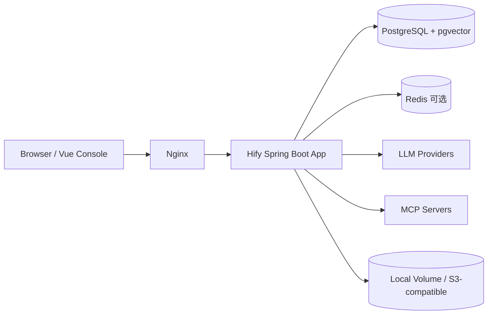
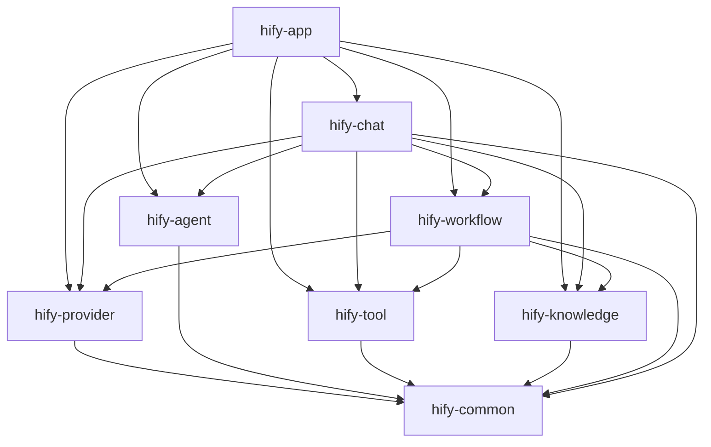
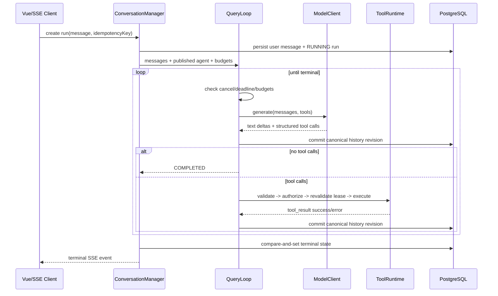
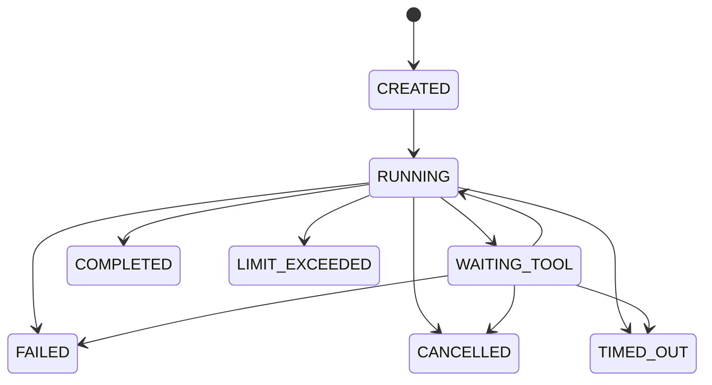

# Hify 架构设计

## 1. 目标形态

Hify 采用 Maven 多模块的模块化单体：开发、测试和依赖在模块层隔离，生产只部署一个 Spring Boot 进程。前端独立构建，由 Nginx 托管并反向代理 API/SSE。



一期不引入 API Gateway、消息队列、服务网格、分布式事务和多副本。理由不是这些技术无价值，而是当前规模的首要风险是外部模型稳定性、长连接、工具副作用和状态收敛。

## 2. 模块与依赖



依赖规则：

- `hify-app` 只负责装配与 transport，不承载领域规则。
- `hify-chat` 是运行编排者，通过各模块公开 port 读取已发布配置或执行能力。
- `hify-agent` 只保存 Agent 定义/版本，不调用 Chat。
- `hify-provider` 适配模型协议，不知道 Conversation、Agent 或 HTTP Controller。
- `hify-tool` 统一内置工具和 MCP 工具的 schema、权限、超时和结果格式。
- `hify-knowledge` 返回检索结果和引用，不直接修改消息。
- `hify-workflow` 编排有限节点，不直接访问其他模块 Repository。
- `hify-common` 仅容纳 ID、时间、错误、分页等业务无关类型；领域 DTO 留在 owner 模块。

前端采用生成的 OpenAPI client + `@tanstack/vue-query` 管理服务端状态；Pinia 只保存登录身份、UI 偏好和未提交的 Agent/Workflow 编辑态。SSE Run 状态由按 `runId` 隔离的 composable 管理，不把后端资源再复制一份到全局 store。

每个业务模块内部统一：

```text
api/             对其他模块公开的 command/query/port/DTO
application/     用例编排、事务边界
domain/          实体、值对象、领域规则
infrastructure/  Repository、模型/MCP/存储适配器
```

HTTP Controller 统一留在 `hify-app` 或模块的 adapter-in 层。禁止 `Controller -> Repository`、跨模块 Entity/Repository 引用和双向依赖。

## 3. Agent 运行时

### 3.0 输入理解与路由

在多 Agent/Workflow 自动路由进入主链路前，Hify 先以独立纵向切片建立两层 Intent Router：确定性层处理取消、帮助、危险动作、精确命令和必填槽位；结构化模型层只处理规则未覆盖的业务语义。两层输出同一个 `IntentDecision`，代码再执行置信阈值、候选差值、缺槽和可执行 route 契约。

当前只开放 `/api/v1/intent-decisions` 预览，不接管 Run。Intent Router 只决定候选出口，不执行副作用；`tool/workflow` 后续接入时仍必须经过 ToolRuntime/WorkflowRuntime 的 schema、权限、预算和幂等控制。详细契约、评测集和演进门槛见 `INTENT_ROUTING.md`。

### 3.1 职责拆分

```text
ConversationManager
  - 会话、消息、用户设置和累计用量
  - 创建 Run，并在昂贵调用前持久化
  - 组装 ContextManager 输出

QueryLoop
  - 单次 Run 的模型/工具循环
  - 状态推进、预算检查、取消与终态
  - 不负责长期上下文裁剪

ToolRuntime
  - 工具注册和 schema
  - 输入校验、权限判定、副作用执行
  - 结果限长、脱敏、错误归类

ContextManager
  - 历史窗口、系统提示、RAG、摘要
  - 产出本次模型输入，但不决定工具执行
```

### 3.2 Query Loop



模型返回结构化 tool call 才会进入工具路径；没有 tool call 只是完成候选，仍必须通过 `FinishGate`：最终回答非空、没有开放的 blocking Gap、所有 required Claim 至少有一条 VERIFIED evidence。模型不能自行宣布完成。

一期工具串行执行，避免并行 tool result 配对、取消和副作用顺序复杂度。后续只有在 trace 证明工具等待为主要瓶颈，且工具声明无顺序依赖/副作用冲突时才加入并行。

Run 接纳时固定 `capabilityRevision/toolSchemaDigest`，模型工具定义与实际执行共享同一能力视图。每个 Attempt 在 schema/权限检查后、调用工具前再次校验 runId、attemptId、能力 revision 和持久化取消状态。模型响应与 tool result 按 operationId 写入 canonical history；只有完成语义快照、mutation、回读校验、revision 和 `history.committed` 投影后，QueryLoop 才继续。相同 operationId 内容不同会失败，不用后写覆盖前写。

每次模型请求前由 ContextManager 计算 `window - output - reserve - safety` 输入预算，消息和工具 schema 一并计量。超限时先把大 Tool Result 投影成 canonical history 引用，重新测量；仍超限才做保留关键约束与最新交互闭包的 checkpoint compaction，再次测量。归档和压缩不改 canonical history，仍超限时明确失败。

### 3.3 Run 状态机



终态只能通过数据库 compare-and-set 写入一次。应用启动时扫描遗留 `RUNNING`：已有持久取消请求的收敛为 `CANCELLED`，其余从最新 restorable checkpoint 恢复；checkpoint 只覆盖当前 read-only 工具，不能被解释为外部副作用回滚。

终止/暂停原因：`COMPLETED`、`MAX_TURNS`、`CANCELLED`、`TIMEOUT`、`TOKEN_BUDGET_EXCEEDED`、`COST_BUDGET_EXCEEDED`、`TOOL_BUDGET_EXCEEDED`、`HUMAN_INPUT_REQUIRED`、`RETRY_EXHAUSTED`、`PERMISSION_DENIED`、`MODEL_ERROR`、`FATAL_TOOL_ERROR`。

### 3.4 默认预算

| 预算 | 默认 | 最大可配 | 执行点 |
|---|---:|---:|---|
| model/tool turns | 8 | 20 | 每次模型调用前 |
| tool calls | 12 | 30 | 每个工具执行前 |
| overall deadline | 120s | 300s | 每轮和外部调用传播 |
| tool timeout | 15s | 60s | 单工具执行 |
| tool result | 32 KiB | 128 KiB | 入历史前截断/摘要 |
| output tokens | 4,096 | 16,384 | 模型请求 |
| cost | Agent 版本配置 | 系统上限 | 每轮估算和最终记账 |

### 3.5 确定性 Replan

当前 read-only Query Loop 以不可变 `ExecutionPlan` 版本和 `ContinuationDecision` 六出口记录控制过程。工具参数错误或已知只读工具别名可触发 `REPLAN`；瞬时失败只做有限 `RETRY`；无安全替代、缺输入或 no-progress 进入 `CLARIFY/NEEDS_INPUT`；权限拒绝、取消、重试耗尽和 fatal error 进入 `INTERRUPT`。Replan/Retry 不重置任何 Run 预算。

`ExecutionContextState` 统一保存 Claim、Evidence 和 Gap；成功工具结果成为 VERIFIED evidence，重复语义状态不新增证据时触发 no-progress。失败点（Attempt）、根因点（Step）、回滚点（Checkpoint）和 Replan 起点分别记录。checkpoint 保存已配对消息、预算计数、Plan 及带版本的 Evidence/Gap 快照，但不是外部副作用回滚。完整契约与适用边界见 `REPLAN.md`。

## 4. 流式事件契约

SSE 是运行事件的投影视图，不是唯一事实源。事件必须有单调 `event_id`、`run_id`、`type`、`created_at` 和版本号。

```text
run.created
run.started
model.started
message.delta
model.completed
tool.call.started
tool.call.completed
tool.call.failed
plan.created
step.try.started
step.try.completed
step.try.failed
replan.decided
confirmation.required
checkpoint.created
checkpoint.restored
history.committed
context.prepared
run.completed
run.failed
run.cancelled
run.needs_input
heartbeat
```

- 浏览器重连通过 `Last-Event-ID` 回放数据库/Redis 中的有限事件窗口。
- token delta 可只在 Redis/内存短期保存，最终 assistant message 和结构化 step 必须入 PostgreSQL。
- 已输出 token 后不自动重放整个供应商请求；失败时发明确 `run.failed`。
- Nginx 关闭响应缓冲，设置大于应用 read-idle 的 proxy timeout，并禁止中间层压缩造成批量刷新。

## 5. 外部调用策略

### 模型

- 每个 provider 独立 bulkhead、连接池、速率限制和熔断统计。
- connect 5s；首字节/读空闲 30s；overall 120s（可由 Agent 在上限内配置）。
- 连接失败、429/5xx 可在“尚未产生输出且无副作用”时指数退避重试最多 2 次。
- 401/403、schema 错误和内容策略拒绝不重试。
- fallback 必须是 Agent 版本中的显式策略，不能静默换模型。

### MCP/工具

- 注册阶段抓取工具列表；运行阶段按固定 schema 快照调用，避免工具定义漂移。
- URL 校验覆盖 scheme、DNS 解析、重定向和私网/metadata 地址；禁止凭证出现在 URL。
- 权限在副作用前判断；write/execute/external 默认需要策略允许。
- 所有调用携带 `run_id/tool_call_id` 幂等上下文；工具若不支持幂等，重试必须关闭。

## 6. RAG 与 Workflow

RAG 是 ContextManager 的检索输入，不进入 QueryLoop 控制流。每条引用保存 chunk id、document version、score 和检索参数，支持答案溯源与检索质量复盘。

Workflow 是受限 DSL 执行器。每个发布版本不可变，Run 保存 DSL snapshot。MVP 不支持任意循环；Condition 必须有默认分支；每个节点复用 Provider/Tool/Knowledge port 和统一预算。

## 7. 可观测性

日志字段至少包含：`request_id`、`conversation_id`、`run_id`、`agent_version_id`、`provider/model`、`turn`、`tool_call_id`、`latency_ms`、`terminal_reason`。Prompt、响应和 tool result 默认不进普通日志；调试内容需显式开启、脱敏并设短保留期。

核心指标：并发 SSE、首 token/总耗时、provider 错误/429、bulkhead 排队、每 Run turns/token/cost、工具错误、取消延迟、遗留运行数、数据库/Redis/连接池健康。

## 8. 对 Dify 的选择性借鉴

| Dify 中已验证的能力边界 | Hify 的取舍 |
|---|---|
| App/Workflow/Agent/RAG 是独立产品对象 | 保留对象化设计，但一期以 Agent 为主线，不复制完整 App modes |
| Agent V2 控制面与独立执行服务分离 | 先在单体内分离 port 和数据 owner；达到故障/扩容触发器后再拆进程 |
| Redis 保存 Agent run/event，但不是任务队列 | Hify 将 Run 终态放 PostgreSQL；Redis 只做 replay/取消加速 |
| Plugin daemon 承载模型、工具、数据源扩展 | 一期使用编译期 adapter + MCP，不建设插件 daemon/市场 |
| Graphon 提供通用图执行 | 一期只做受限 JSON Workflow，不引入通用图引擎依赖 |
| RAG 横跨对象、关系、向量和异步任务 | 保留清晰数据 owner、citation 和可恢复索引任务，缩小文件/分块范围 |
| Sandbox/Agent runtime 支持 shell | MVP 明确不提供任意代码/shell，先消除最高风险面 |
| 大型 Next.js Console 和多状态框架 | 使用 Vue 3 单一状态方案，只做五个核心页面 |

Hify 只借鉴概念和边界，不复制 Dify 源码或 UI。若未来直接使用 Dify 前端或构建多租户服务，需要重新审查其修改版 Apache 2.0 附加条件。
