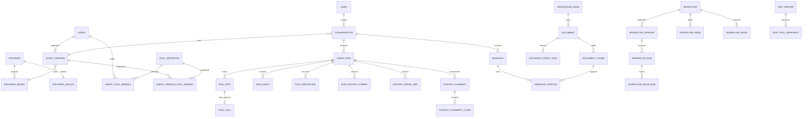

# Hify 数据模型

## 1. 数据所有权

- PostgreSQL：用户、Provider、Agent、工具绑定、Conversation、Message、Run、结构化事件、Knowledge 元数据、向量和 Workflow。
- Redis（可选）：短期配置缓存、限流、分布式取消信号和 SSE replay；任何键都可重建。
- Object Storage：原始上传文档；本地部署可使用受控 volume，接口保持 S3-compatible。
- 环境变量/Secret Store：模型与 MCP 凭证。数据库只保存 `credential_ref`。

## 2. 核心关系

## 3. 表清单

| 表 | 关键字段/约束 |
|---|---|
| `users` | `id`, `username` unique, password/auth state；一期只有 admin/member 两个固定角色 |
| `providers` | 内部 BIGINT `id`、外部 `public_id`、name/type/base_url、版本化 `auth_config`、default_model_id、enabled；auth JSON 只存 credentialRef 等元数据，不存 key |
| `provider_models` | provider_id、display_name、model_id、enabled/is_default/sort_order；`provider_id+model_id` unique |
| `provider_health` | provider_id 一对一、status/latency_ms/error_code/message/checked_at；与低频配置写分离 |
| `agent_definitions` | 当前迁移期草稿表：id/name unique/prompt/provider/model/参数/draft_revision/published_version_id/archived_at；后续可重命名但外部 ID 不变 |
| `agent_versions` | agent_id、version_no、不可变规范化配置列、snapshot_digest；agent+version unique |
| `tool_definitions` | tool identity, source, schema_version, input_schema JSONB, risk |
| `mcp_servers` | public_id、name、transport、server_url、credential_ref、policy、revision、schema_digest、status |
| `mcp_tool_snapshots` | server_id、server_revision、tool_name、description、input_schema JSONB、risk、schema_digest；server revision + tool unique |
| `mcp_debug_calls` | call_id、server/tool/schema digest、arguments digest、result ref、is_error、elapsed_ms；不保存凭证明文 |
| `agent_tool_bindings` | agent_id + tool_name unique；仅表示可变草稿工具集合，归档时物理清理 |
| `agent_version_tool_bindings` | agent_version_id + tool_name unique；发布时复制的不可变运行快照 |
| `conversations` | user_id, agent_version_id, title, status, last_message_at |
| `messages` | conversation_id, sequence, role, content JSONB, tool_call_id, token_usage |
| `agent_runs` | conversation_id, agent_version_id, agent_snapshot_digest, capability_revision, tool_schema_digest, state, terminal_reason, `cancel_requested_at`, `resumed_from_run_id`, `resolved_gap_ids`, deadlines/budgets/usage, version |
| `run_steps` | run_id, sequence, kind, status, input/output summary, latency, error_code |
| `run_events` | run_id, monotonic sequence, event_type, payload JSONB, created_at |
| `run_checkpoints` | run_id, sequence, checkpoint_id, turn/tool 计数、plan id/version/digest、evidence/gap version、plan/context/messages snapshot、restorable |
| `run_history_commits` | run_id、revision、operation_id、semantic_digest、messages_json、committed_at/projected_at；run+revision 与 run+operation unique |
| `history_detail_refs` | run/conversation、canonical revision + message index、kind、digest、preview、关键词/实体/token、64 维派生 embedding；只保存派生目录，不保存第二份权威原文 |
| `context_summaries` | run/conversation、range、kind、结构化目标/事实/约束/决策/gap、source refs、digest、version、CURRENT/INVALID/CONFLICTING |
| `context_summary_claims` | summary、claim key/type、statement、source refs、VERIFIED/MISSING_SOURCE/CONTRADICTED；每条关键结论可追溯 |
| `child_agent_tasks` | parent_run_id、child_run_id、task_digest、state、output_ref/digest、output_state、claim_token、recovery_action、executor_id、attempt_count、version |
| `tool_calls` | run_id, run_step_id, call_id unique per run, tool identity, input/output refs, idempotency_key |
| `knowledge_bases` | public_id、name、description、embedding profile、chunk strategy、enabled、archived_at |
| `documents` | public_id、knowledge_base_id、name/MIME/size、canonical content/object_key、checksum、version、indexing_state/error、archived_at |
| `document_index_tasks` | document/version、state、attempt、lease、checkpoint、error、started/finished；可恢复派生任务 |
| `document_chunks` | public_id、document/version、ordinal、content、content_digest、token_count、tsvector、embedding vector、metadata JSONB |
| `message_citations` | message_id, chunk_id, score, rank, retrieval snapshot |
| `workflows` | public_id、name、description、draft_revision、published_version_id、archived_at |
| `workflow_nodes` | workflow_id、node_key、type、name、config JSONB；workflow+node_key unique |
| `workflow_edges` | workflow_id、edge_key、source/target、condition/default flag |
| `workflow_versions` | workflow_id、version、schema_version、immutable DSL JSONB、checksum |
| `workflow_runs` | workflow_version_id/digest、status、input/output/error、context snapshot、elapsed、version |
| `workflow_node_runs` | run_id、sequence、node key/type、status、input/output refs、error、elapsed |

## 4. 约束与索引

- 主键对外使用 UUIDv7/ULID，避免暴露规模；内部是否使用 BIGINT 不形成产品契约。
- 不执行“一律禁止 NULL”。必填字段 `NOT NULL`，真正未知/不适用的可空语义保留 NULL，避免用 `0`/空串混淆。
- 所有状态字段用受控字符串 + application enum；数据库 CHECK 约束保护终态集合。
- `agent_runs(state, updated_at)` 支持启动恢复扫描；终态更新使用 `WHERE state IN (...) AND version=?`。
- `agent_runs(conversation_id, idempotency_key)` unique；同时保存 request checksum，用于区分合法重放和 key 误复用。
- `messages(conversation_id, sequence)` unique；列表按 sequence 游标分页。
- `run_events(run_id, sequence)` unique；支持 `Last-Event-ID` replay。
- `run_checkpoints(run_id, sequence)` unique；完整 Plan 与 ExecutionContextState 快照保证恢复前后的 plan/evidence/gap 版本一致，只保存完成 tool call/result 配对后的恢复点。当前仅允许恢复 read-only Run。
- `run_history_commits(run_id, operation_id)` unique；相同 operation 只有 semantic digest 相同时可重放，内容变化必须冲突。`projected_at` 非空表示必要 `history.committed` 投影已经完成。
- `history_detail_refs(run_id, source_message_index, content_digest)` unique；读取细节必须按 source revision/message index 回到 canonical history 并重新校验 digest。
- PostgreSQL 为 `history_detail_refs` 建 GIN FTS 与 cosine HNSW；两者都是可重建派生索引，不能成为 Claim 的 VERIFIED sourceRef。
- `context_summaries(run_id, kind, summary_version)` unique；摘要是导航而非证据，无有效 source refs 的 claim 使摘要无效，同 key 不同陈述使摘要进入冲突态。
- `child_agent_tasks` 将执行生命周期和输出消费生命周期分离；数据库约束保证非 SUCCEEDED 任务没有输出、CLAIMED/CONSUMED 必须有 claim token。父 Run COMPLETED 后才可从 CLAIMED 进入 CONSUMED。
- `providers(public_id)` 与 `providers(name)` unique；Agent 引用不透明 public_id，运行时从 ProviderQueryService 获取已启用配置快照。
- `provider_models(provider_id, model_id)` unique；模型目录整体替换时物理删除旧子项，避免逻辑删除 tombstone 与唯一约束冲突。
- `provider_health(provider_id)` unique；健康检查不改变 Provider 配置行，也不驱逐 `provider-cache`。
- `agent_runs(resumed_from_run_id)` 记录 NEEDS_INPUT 后的新 Run 恢复链；恢复必须保持 conversation 相同，`resolved_gap_ids` 是当前 MVP 的审计投影，权威 Gap 状态仍在 checkpoint context snapshot。
- `conversations.agent_version_id` 在会话创建时固定；`agent_runs.agent_version_id/agent_snapshot_digest` 再次投影执行证据，草稿更新不得改变旧会话。
- `agent_definitions.name` unique，归档后名称仍保留；`archived_at` 非空的草稿不能再管理或创建 Conversation。
- `agent_tool_bindings(agent_id, tool_name)` 与 `agent_version_tool_bindings(agent_version_id, tool_name)` 分离；发布 digest 覆盖排序后的工具集合，归档只删除草稿绑定。
- `tool_calls(run_id, call_id)` unique；写工具另存 idempotency key。
- `document_chunks` 为 embedding 建 HNSW；检索必须带 knowledge_base/filter 和 LIMIT。
- `document_chunks` 同时建 FTS GIN；全文与向量候选只融合排名，不直接相加不可比分数。
- `workflow_nodes(workflow_id,node_key)`、`workflow_edges(workflow_id,edge_key)` unique；发布校验拒绝悬空边、不可达节点、无默认分支和环。
- `mcp_tool_snapshots(server_id,server_revision,tool_name)` unique；刷新只追加 revision，Run 通过 schema digest 固定旧版本。
- `message_citations(message_id, rank)` 与 `document_chunks(document_id, ordinal)` 建索引。
- 删除策略按 owner 定义：配置型实体优先停用；Conversation/Document 的级联删除走异步清理并保留审计结果。

## 5. 事务边界

- 创建 Run：user message、run、初始 event 同事务提交，之后才调用模型。
- 外部模型/工具 I/O 不放数据库事务中；结果用短事务追加 step/event。
- canonical history 在短事务中捕获快照、写入并回读；必要投影完成后才向 QueryLoop ack。该协议不覆盖远端副作用事务。
- 终态写入 compare-and-set，取消、超时、成功只能有一个胜者。
- Agent/Workflow 发布：校验、版本快照、published pointer 同事务。
- 文档索引：document 状态与 chunk 批次可重试；原文件和向量写入失败时有补偿/重建路径。
