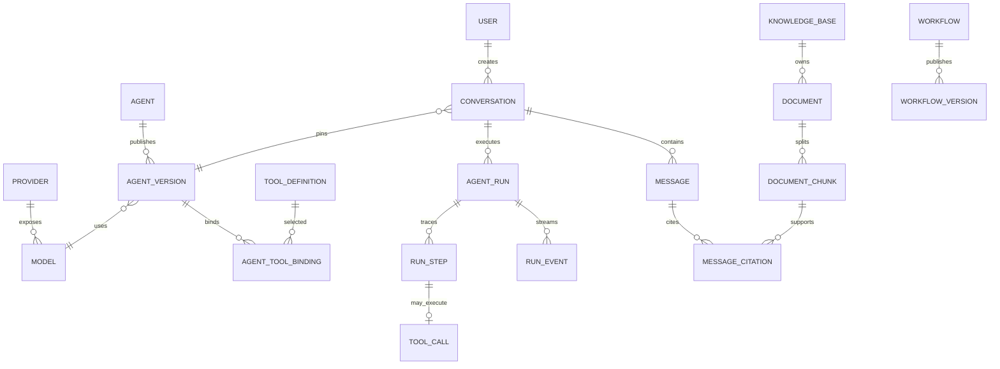

# Hify 数据模型

## 1. 数据所有权

- PostgreSQL：用户、Provider、Agent、工具绑定、Conversation、Message、Run、结构化事件、Knowledge 元数据、向量和 Workflow。
- Redis（可选）：短期配置缓存、限流、分布式取消信号和 SSE replay；任何键都可重建。
- Object Storage：原始上传文档；本地部署可使用受控 volume，接口保持 S3-compatible。
- 环境变量/Secret Store：模型与 MCP 凭证。数据库只保存 `credential_ref`。

## 2. 核心关系

## 3. 表清单

| 表 | 关键字段/约束 |
|---|---|
| `users` | `id`, `username` unique, password/auth state；一期只有 admin/member 两个固定角色 |
| `providers` | name, type, base_url, credential_ref, enabled；不存 key |
| `models` | provider_id, model_name, capabilities, enabled；provider+name unique |
| `agents` | name, description, current_draft_revision, published_version_id |
| `agent_versions` | agent_id, version, immutable config JSONB, checksum；agent+version unique |
| `tool_definitions` | tool identity, source, schema_version, input_schema JSONB, risk |
| `mcp_servers` | name, transport, server_url, credential_ref, policy, status |
| `agent_tool_bindings` | agent_version_id, tool_definition_id, schema snapshot/policy |
| `conversations` | user_id, agent_version_id, title, status, last_message_at |
| `messages` | conversation_id, sequence, role, content JSONB, tool_call_id, token_usage |
| `agent_runs` | conversation_id, agent_version_id, state, terminal_reason, deadlines/budgets/usage, version |
| `run_steps` | run_id, sequence, kind, status, input/output summary, latency, error_code |
| `run_events` | run_id, monotonic sequence, event_type, payload JSONB, created_at |
| `tool_calls` | run_id, run_step_id, call_id unique per run, tool identity, input/output refs, idempotency_key |
| `knowledge_bases` | name, embedding_model_id, chunk strategy |
| `documents` | knowledge_base_id, object_key, checksum, version, indexing_state |
| `document_chunks` | document_id, ordinal, content, embedding vector, metadata JSONB |
| `message_citations` | message_id, chunk_id, score, rank, retrieval snapshot |
| `workflows` | name, draft revision, published_version_id |
| `workflow_versions` | workflow_id, version, schema_version, immutable DSL JSONB, checksum |

## 4. 约束与索引

- 主键对外使用 UUIDv7/ULID，避免暴露规模；内部是否使用 BIGINT 不形成产品契约。
- 不执行“一律禁止 NULL”。必填字段 `NOT NULL`，真正未知/不适用的可空语义保留 NULL，避免用 `0`/空串混淆。
- 所有状态字段用受控字符串 + application enum；数据库 CHECK 约束保护终态集合。
- `agent_runs(state, updated_at)` 支持启动恢复扫描；终态更新使用 `WHERE state IN (...) AND version=?`。
- `agent_runs(conversation_id, idempotency_key)` unique；同时保存 request checksum，用于区分合法重放和 key 误复用。
- `messages(conversation_id, sequence)` unique；列表按 sequence 游标分页。
- `run_events(run_id, sequence)` unique；支持 `Last-Event-ID` replay。
- `tool_calls(run_id, call_id)` unique；写工具另存 idempotency key。
- `document_chunks` 为 embedding 建 HNSW；检索必须带 knowledge_base/filter 和 LIMIT。
- `message_citations(message_id, rank)` 与 `document_chunks(document_id, ordinal)` 建索引。
- 删除策略按 owner 定义：配置型实体优先停用；Conversation/Document 的级联删除走异步清理并保留审计结果。

## 5. 事务边界

- 创建 Run：user message、run、初始 event 同事务提交，之后才调用模型。
- 外部模型/工具 I/O 不放数据库事务中；结果用短事务追加 step/event。
- 终态写入 compare-and-set，取消、超时、成功只能有一个胜者。
- Agent/Workflow 发布：校验、版本快照、published pointer 同事务。
- 文档索引：document 状态与 chunk 批次可重试；原文件和向量写入失败时有补偿/重建路径。
