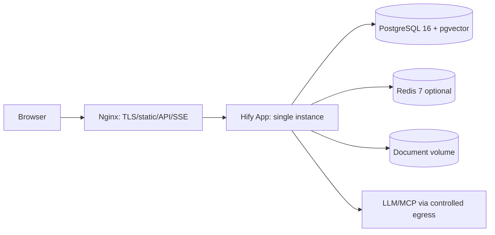

# Hify 部署、容量与演进

## 1. MVP 部署

Docker Compose 是默认交付物。数据库、Redis 和文档目录必须持久化 volume；应用容器无持久业务状态。开发环境允许 mock provider；生产启动时拒绝默认密码、空 signing key 和调试日志。

共享宿主机时可把 Console 发布到 `/hify/`：前端以
`VITE_BASE_PATH=/hify/ VITE_API_BASE_URL=/hify/api npm run build` 构建，并在现有 TLS server 中
include `deploy/nginx-path.conf`。该片段将静态资源隔离在 `/hify/`，将 `/hify/api/` 去前缀后代理到应用，
同时关闭 SSE buffering；不得让 Hify 抢占宿主机已有 `/api/` 或根页面。

## 2. SSE/Nginx

- `proxy_buffering off`、关闭响应缓存；设置 `X-Accel-Buffering: no`。
- proxy read timeout 大于应用 read-idle；应用每 15 秒 heartbeat。
- 用户显式取消立即传播；网络断线本身不等于取消，Run 在 deadline 内继续，客户端重连后按 event id replay。
- 监控 active SSE、连接时长、首 token、断线率和 bulkhead queue wait。

## 3. 备份与恢复

- PostgreSQL：每日逻辑/物理备份 + WAL/PITR（生产），每月至少一次恢复演练。
- 文档 volume/object storage：与 DB 备份保持同一恢复点或用 checksum/reindex 修复。
- Redis 不进入关键恢复路径；可清空后从 DB 重建。
- 恢复验收：Provider/Agent 版本、Conversation/Message、Run 终态、文档索引和引用一致。

## 4. 发布与回滚

1. 备份并校验恢复点。
2. 执行向后兼容迁移；应用先兼容旧/新 schema。
3. 健康检查覆盖 DB、迁移版本、provider adapter 装配，不主动调用付费模型。
4. 发布后执行 mock provider 对话、工具调用、SSE、取消和检索 smoke test。
5. 应用可回滚；不可逆数据迁移必须分 expand/backfill/contract 三次发布。

## 5. 容量假设

50 人、60% 活跃、每人每分钟 2 条消息，用户请求约 1 QPS；RAG/工具放大后仍低。瓶颈是 10-120 秒外部调用占用连接、Provider 限流和 token 成本，而不是 CRUD 吞吐。

一期目标：100 个并发 SSE、应用 CPU P95 < 70%、bulkhead 排队 P95 < 1s、数据库连接使用 P95 < 70%。这些是容量演练目标，不是未经测试的承诺。

## 6. 演进触发器

| 阶段 | 触发条件（连续观测） | 改什么 | 不改什么 |
|---|---|---|---|
| 单实例 | 20-50 人；SSE < 100 | bulkhead、超时、取消、备份 | 不上 K8s/MQ/微服务 |
| 多副本 | 可用性要求或单实例 CPU/连接池 > 70% | 2-3 app replicas、共享取消/replay、负载均衡 | 模块化单体不拆 |
| 异步长任务 | 文档索引/Workflow 排队超过 SLO，重启需恢复 | 持久任务表或消息队列、worker | Chat 的交互式 Query Loop 仍同步流式 |
| 独立向量库 | chunks 达百万级且 pgvector P95/维护窗口不达标 | 评估 Qdrant/Milvus | 关系元数据 owner 不变 |
| 微服务 | 模块发布/扩容/故障隔离长期互相阻塞 | 先拆资源消耗最大的运行模块 | 不按“域数量”一次性全拆 |

任何演进需要基准测试、故障演练和 ADR，不能只按用户数拍脑袋。

## 7. 告警

- P0：无法创建 Run、终态不收敛、凭证泄露、数据不可读、备份失败。
- P1：Provider 失败率/429 激增、SSE 首 token 或断线超 SLO、orphan runs > 0、工具超时激增。
- P2：成本偏离、索引积压、Redis 命中下降、数据库慢查询。
