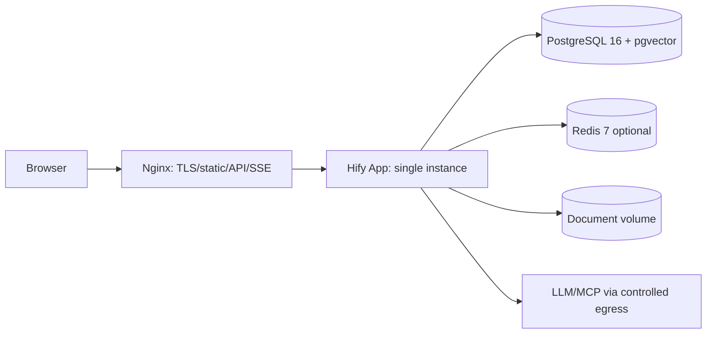

# Hify 部署、容量与演进

## 1. MVP 部署

```mermaid
flowchart LR
  B[Browser] --> N[Nginx: TLS/static/API/SSE]
  N --> H[Hify App: single instance]
  H --> P[(PostgreSQL 16 + pgvector)]
  H --> R[(Redis 7 optional)]
  H --> V[(Document volume)]
  H --> X[LLM/MCP via controlled egress]
```

Docker Compose 是默认交付物。数据库、Redis 和文档目录必须持久化 volume；应用容器无持久业务状态。开发环境允许 mock provider；生产启动时拒绝默认密码、空 signing key 和调试日志。

共享宿主机时可把 Console 发布到 `/hify/`：前端以
`VITE_BASE_PATH=/hify/ VITE_API_BASE_URL=/hify/api npm run build` 构建，并在现有 TLS server 中
include `deploy/nginx-path.conf`。该片段将静态资源隔离在 `/hify/`，将 `/hify/api/` 去前缀后代理到应用，
同时关闭 SSE buffering；不得让 Hify 抢占宿主机已有 `/api/` 或根页面。

## 2. SSE/Nginx

- `proxy_buffering off`、关闭响应缓存；设置 `X-Accel-Buffering: no`。
- proxy read timeout 大于应用 read-idle；应用每 15 秒 heartbeat。
- 用户显式取消立即传播；网络断线本身不等于取消，Run 在 deadline 内继续，客户端重连后按 event id replay。
- 监控 active SSE、连接时长、首 token、断线率和 bulkhead queue wait。

## 3. 备份与恢复

- PostgreSQL：每日逻辑/物理备份 + WAL/PITR（生产），每月至少一次恢复演练。
- 文档 volume/object storage：与 DB 备份保持同一恢复点或用 checksum/reindex 修复。
- Redis 不进入关键恢复路径；可清空后从 DB 重建。
- 恢复验收：Provider/Agent 版本、Conversation/Message、Run 终态、文档索引和引用一致。

## 4. 发布与回滚

1. 备份并校验恢复点。PostgreSQL 宿主机预装 pgvector 包，并由数据库管理员执行一次
   `CREATE EXTENSION IF NOT EXISTS vector`；应用账号不授予 superuser。
2. 执行向后兼容迁移；应用先兼容旧/新 schema。Flyway V13 负责 embedding 列、旧目录回填和 HNSW，
   但不把扩展安装权限当成应用运行权限。
3. 健康检查覆盖 DB、迁移版本、provider adapter 装配，不主动调用付费模型。
4. 发布后执行 mock provider 对话、工具调用、SSE、取消和检索 smoke test。
5. 应用可回滚；不可逆数据迁移必须分 expand/backfill/contract 三次发布。

## 5. 容量假设

50 人、60% 活跃、每人每分钟 2 条消息，用户请求约 1 QPS；RAG/工具放大后仍低。瓶颈是 10-120 秒外部调用占用连接、Provider 限流和 token 成本，而不是 CRUD 吞吐。

一期目标：100 个并发 SSE、应用 CPU P95 < 70%、bulkhead 排队 P95 < 1s、数据库连接使用 P95 < 70%。这些是容量演练目标，不是未经测试的承诺。

当前 Run 执行只支持单实例；部署升级须停止旧实例后再启动新实例，不能让两份应用同时恢复/执行同一数据库中的 RUNNING Run。进程内 dispatch owner 仅防止本实例 create 与恢复重入，不是跨实例租约。多副本演进必须先实现持久化 attempt/lease CAS、过期接管和 fencing；下表是演进规划，不是已实现部署方式。

启动恢复沿用当前有界 Run 池（core2/max4/queue100）。瞬时提交超过可用执行/队列容量的 Run 会落为 FAILED / EXECUTOR_REJECTED，而非持久待调度队列；管理员/用户须检查终态并用新幂等键重新发起。扫描得到列表后按行隔离异常：一行数据库操作失败会记录 runId/异常类型并继续，不打印 SQL/异常正文；该行留待后续启动处理，目前没有定时重扫。最初读取列表失败仍可能导致启动失败，不能声称数据库不可用时也能恢复。

关闭流程：ContextClosedEvent 先标记本实例 stopping，停止新调度/执行资格；runExecutor 在持久层销毁前中断并等待最多5秒。停止信号传入模型/工具/Workflow 控制，不能当成用户取消或 Provider 健康失败。只有被关闭中断的未完成 AgentRun 保留 RUNNING，可写库时留 run.interrupted；已计算结果照常提交，不因 stopping 重复生成。下次启动按 checkpoint 接续未终态 Run。Workflow 中断执行留下 INTERRUPTED，新的执行保留原 workflowVersionId；已完成的 END 不因关闭标志被改写。启动先把本实例启动时间之前遗留的 Workflow RUNNING 行收敛为 INTERRUPTED，再进行 AgentRun 恢复（兼容 kill -9 无法留痕的情况）。Workflow 孤儿整表 UPDATE 失败也可能导致启动失败，并非按行容错。

预算限制尚有差异：Workflow 恢复按 createdAt 扣减，而 Chat 的 QueryLoop 恢复仍重新获得完整 runTimeout，不能将其表述为跨重启总耗时上限。子任务恢复监听与父 Run 扫描尚无显式顺序，后续需要单独验证。时钟回拨及非合作驱动/连接池在中断中的行为不在当前恢复保证内。

V22 仅扩展 Workflow Run/Node CHECK 约束，保留已有版本/记录。回滚应用不得删除已写出的 INTERRUPTED 记录或收紧约束；旧应用/UI未验证对此状态的兼容性，回滚前需评估。关闭等待不是不合作驱动的强制终止，也不保证外部副作用恰好一次；模型的未闭合响应可能重新调用，Workflow 从头重跑当前确定性/只读节点。数据库写失败会让中断事件缺失，但不因此伪造取消。跨实例并行恢复、持久 lease，以及 Workflow/AgentRun 最终提交竞争的投影协调仍属独立边界。

## 6. 演进触发器

| 阶段 | 触发条件（连续观测） | 改什么 | 不改什么 |
|---|---|---|---|
| 单实例 | 20-50 人；SSE < 100 | bulkhead、超时、取消、备份 | 不上 K8s/MQ/微服务 |
| 多副本 | 可用性要求或单实例 CPU/连接池 > 70% | 2-3 app replicas、共享取消/replay、负载均衡 | 模块化单体不拆 |
| 异步长任务 | 文档索引/Workflow 排队超过 SLO，重启需恢复 | 持久任务表或消息队列、worker | Chat 的交互式 Query Loop 仍同步流式 |
| 独立向量库 | chunks 达百万级且 pgvector P95/维护窗口不达标 | 评估 Qdrant/Milvus | 关系元数据 owner 不变 |
| 微服务 | 模块发布/扩容/故障隔离长期互相阻塞 | 先拆资源消耗最大的运行模块 | 不按“域数量”一次性全拆 |

任何演进需要基准测试、故障演练和 ADR，不能只按用户数拍脑袋。

## 7. 告警

SSE 投影独立于 Run 提交：`HIFY_SSE_MAX_SUBSCRIBERS` 默认 64（允许 1–256），饱和时返回 503，不排队无限增长。每个连接一个发送 worker，历史分页每页 32 条；慢连接不占用 Run 线程或持有数据库事务。`HIFY_HTTP_CONNECTION_TIMEOUT` 默认 10s，Tomcat NIO 将其用于 socket 阻塞写的无进展超时，也用于请求读取，不能设为无限。反向代理的发送超时/连接数应同步限制；持续缓慢读取不等于完全不读，10s 不是整条 SSE 的绝对寿命。客户端按 Last-Event-ID 重连，并回读持久 Run 结果。

MCP 直接 Token 配置：部署时生成独立随机 32-byte Base64 `HIFY_MCP_MASTER_KEY`，放在仅服务用户可读的环境文件中，启动时注入；Compose 也从同名变量读取。不设置时只支持 env/system 引用。不要把主密钥复制进数据库、镜像、日志或 Git。数据库恢复必须同时恢复匹配主密钥；已有密文时禁止重新生成覆盖主密钥。首次配置需重启，后续页面更换 Token 无需重启。细节与回滚限制见 ADR-0020。

不要用命令行 `-D`、`JAVA_TOOL_OPTIONS`、`JDK_JAVA_OPTIONS` 或 `JAVA_OPTS` 传递主密钥/凭据；命令行与启动选项聚合字段可能出现在诊断信息或可查询的系统属性中。引用授权也不得放行这些聚合值或 `system:sun.java.command`。现有保留名单不是对任意聚合内容的自动秘密识别。

引用授权（安全升级）：env/system 默认拒绝，管理员另外配置 `HIFY_CREDENTIAL_REFERENCE_BINDINGS` JSON，例如 `{"env:TEAM_LLM_KEY":["https://api.example.com/v1"],"env:MCP_TOKEN":["https://tools.example.com/mcp"]}`。只包含变量/属性名与目标地址，不包含密钥值；地址精确匹配（scheme、host、port、path），无通配、不允许query/userinfo/fragment。配置错误启动失败，不回显输入。参考 ADR-0021。

Provider 的授权地址必须使用**保存后的 Base URL（去掉所有尾部 `/`）**：页面填 `https://api.example.com/v1/`，授权表应写 `https://api.example.com/v1`；仅根地址则写 `https://api.example.com`，不要补 `/`。授权地址本身不替你去尾斜杠；误写会拒绝调用，不会放宽匹配。MCP 不做这项 Provider 归一化，授权路径应与保存的 endpoint 完全一致，`/mcp` 与 `/mcp/` 不等价。

基础设施引用即使运维误授权也拒绝启动：`HIFY_MCP_*`、`HIFY_CREDENTIAL_*`、`HIFY_CREDENTIALS_*`、`SPRING_*`、`DB_*`、`DATABASE_*`、`HIFY_DB_*`、`HIFY_REDIS_*`、`javax.net.ssl.*`。名字比较忽略大小写并把 `.`/`-` 转成 `_`。因此 `env:HIFY_DB_PASSWORD`、`system:javax.net.ssl.keyStorePassword` 和 `system:javax.net.ssl.trustStorePassword` 不能作为外发凭据；MCP 主密钥的 `masterKey`/`MASTERKEY` 宽松绑定别名及以后添加的同命名空间配置也受保护。升级前，原来放在这些保留命名空间的合法外部 Token 应由运维迁到专用非基础设施名称（例如 `TEAM_TOOL_TOKEN`），同步更新显式目的地授权及业务引用，不能通过扩大授权豁免基础设施配置。已有不可变版本若保留旧引用会 fail-closed，需新发布并使用新会话；旧版本不被静默改写。该名单不是任意自定义秘密的自动分类器；其他应用凭据仍需运维逐项审查授权。

升级前仅盘点现有引用名/目标地址，逐项确认可信并建立授权，不能从全部数据库行自动生成不加审查的许可。没有授权的旧引用会在调用前被拒绝；加密 TOKEN 与无鉴权模式不受影响。不要读取或输出环境变量真实值、不要改写主密钥、不要复制授权中的凭据值。服务重启后配置生效；此变更无需数据库迁移。

- P0：无法创建 Run、终态不收敛、凭证泄露、数据不可读、备份失败。
- P1：Provider 失败率/429 激增、SSE 首 token 或断线超 SLO、orphan runs > 0、工具超时激增。
- P2：成本偏离、索引积压、Redis 命中下降、数据库慢查询。
